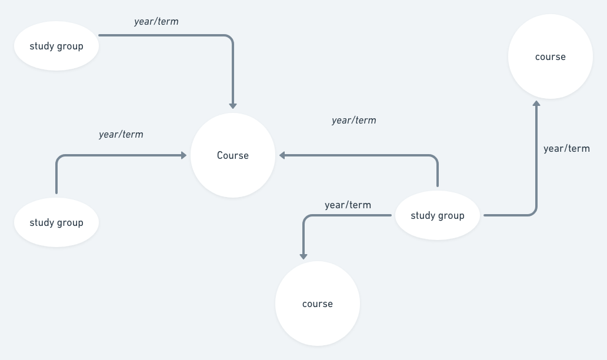
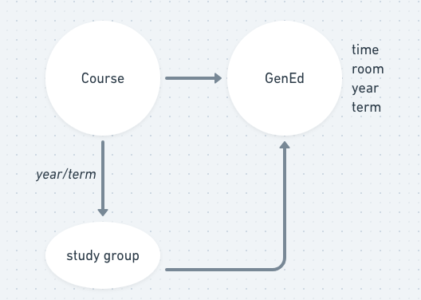
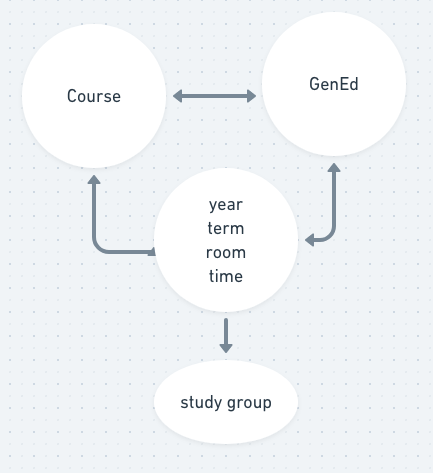
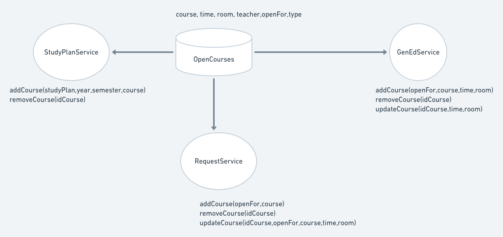

** design การกำหนดรายวิชาสำหรับชั้นเรียน **



| กลุ่มเรียน | วิชา | กลุ่มเรียน-วิชา  |
| ------- |:---:| ------------:|
|  id กลุ่ม | id วิชา | id กลุ่ม    |
|  id แผน | ข้อมูลพื้นฐานต่างๆของวิชา | id วิชา |
|         |     |       ปี       |
|         |     |       เทอม    |

```JS
course->addGroup(idGroup)
//เหมือนกับ
group->addCourse(idCourse)
```
```SQL
if not exists (   
    select 1 
    from กลุ่มเรียน-วิชา 
    where id กลุ่ม = % and id วิชา = % and ปี = % and เทอม = %
)
begin
 insert into กลุ่มเรียน-วิชา value (id กลุ่ม,id วิชา,ปี,เทอม)
end

```
** design การกำหนดรายวิชาศึกษาทั่วไป **



การเลือกวิชาศึกษาทั่วไป หากเลือกกลุ่มเรียนแล้ว ข้อมูล เวลา และห้อง จะถูกนำไปอัพเดทด้วย



| กลุ่มเรียน | วิชา | กลุ่มเรียน-วิชา  | วิชาศึกษาทั่วไป |
| ------- |:---:|:------------:| ---------- |
| id กลุ่ม | id วิชา | id กลุ่ม |id วิชา|
| id แผน | ข้อมูลพื้นฐานต่างๆของวิชา | id วิชา |id กลุ่ม|
|||ปี||
|||เทอม||
|||เวลา||
|||ห้อง||
|||id วิชาศึกษาทั่วไป||

```js
genED->selectCourse(course)
genED->addTime(time)
genEd->addRoom(room)
genEd->selectStudyGroup(group)

function selectStudyGroup(group){
    course = this.studyList.where('courseId',group.course.id)
    course.time = group.time
    course.room = group.room
}
```
** design service รวมทั้งหมด **


